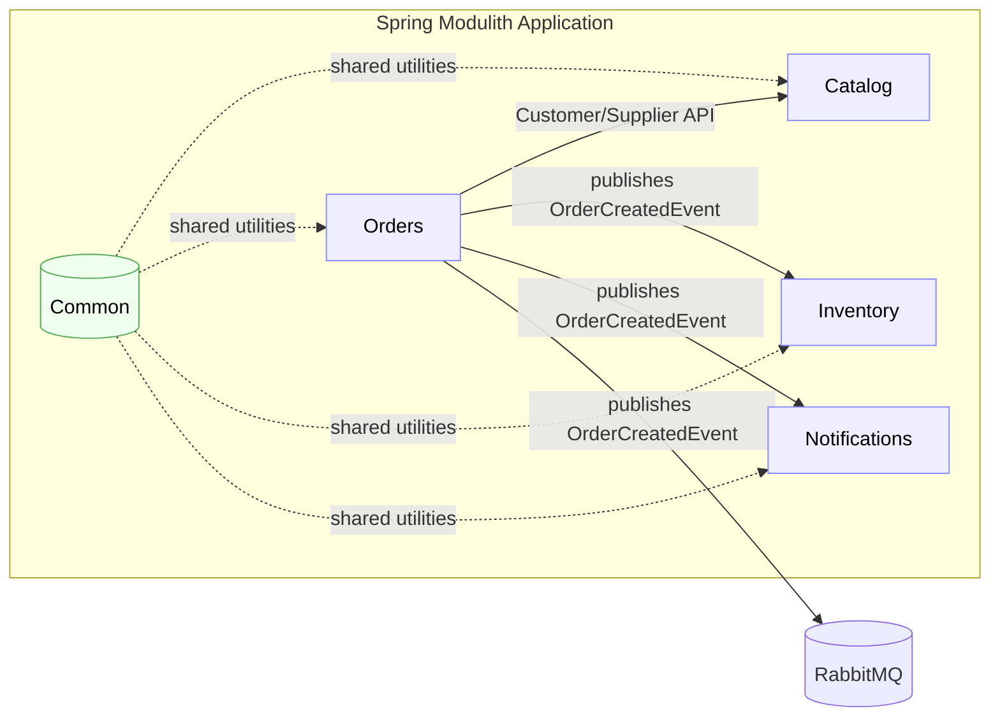

# Domain-Driven Decomposition for Microservices: Migration Study

**Doménovo orientovaná dekompozícia ako stratégia migrácie z monolitov na mikroslužby**

**Typ dokumentu:** Industry whitepaper (teoretická fáza, bez produkčnej telemetrie)

**Autori:** …

**Kľúčové pojmy:** DDD, bounded context, context map, Strangler Fig, Saga, outbox, idempotencia, 12‑Factor, observability

---

## Executive Summary

* Prečo DDD pre migrácie: presné hranice, menšia prepojenosť, lepšia zmenovosť.
* Čo dokument prináša: rámec, metriky, migračné vzory, hodnotiace kritériá.
* Čo dokument neobsahuje: implementáciu, produkčnú telemetriu, kompletnú refaktorizáciu.
* Pre koho: architekti, tech leadri, vlastníci domény.

---

## Abstrakt

Článok medzi monolitom a mikroslužbami skúma doménovo orientovanú dekompozíciu vedenú DDD a vzormi Strangler Fig, Saga a outbox. Ako prípadovú štúdiu používame verejný repozitár **andrejvysny/spring-modular-monolith**: e‑commerce **modulárny monolit** postavený na **Spring Modulith** s modulmi **Common, Catalog, Orders, Inventory, Notifications**; každý modul spravuje vlastné dáta (oddelené schémy `catalog`, `orders`, `inventory`) a preferuje **event‑driven** komunikáciu. Modul **Orders** pri úspešnom vytvorení objednávky publikuje **OrderCreatedEvent**, ktorý konzumujú **Inventory** a **Notifications**; udalosť sa zároveň propaguje do externého brokera (**RabbitMQ**). Repo poskytuje pripravené **observability** a **ops** podklady: **Zipkin**, **Spring Actuator** vrátane **/actuator/modulith**, **Docker Compose** a manifesty pre **Kubernetes/KinD**; build je **Maven/JDK 24**. Táto konfigurácia umožňuje navrhnúť realistický migračný plán bez produkčnej telemetrie a vytvoriť overiteľné rozhodovacie artefakty (mapy kontextov, kontrakty, návrhy Ság a ACL) pre neskoršiu empirickú fázu.

---

## 1. Úvod

Modernizačné projekty informačných systémov často narážajú na limity monolitickej architektúry: rastúcu komplexitu, expanzívnu „zmenovú plochu“ a skryté väzby medzi modulmi, ktoré sťažujú zmeny a zvyšujú riziko regresií. V prostredí s rýchlo sa meniacimi požiadavkami to vedie k spomaleniu dodávky a k nárastu operačného rizika. Strategické princípy doménovo orientovaného návrhu (DDD) ponúkajú spôsob, ako zosúladiť softvérový dizajn s mentálnym modelom domény a vytvoriť agendu pre udržateľnú dekompozíciu systému do jasne ohraničených častí.

Praktická skúsenosť ukazuje, že heuristické alebo technológiou vedené „rezy“ monolitu často zlyhávajú. Bez explicitnej doménovej perspektívy dochádza k chybnej granularite služieb: príliš jemné delenie zvyšuje prevádzkovú zložitosť, príliš hrubé zachováva pôvodnú prepojenosť. Následkom sú nekonzistentné invarianty, rozkmitané zodpovednosti za dáta a potreba ťažkopádnych distribuovaných transakcií. Vzniká architektúra, ktorá je formálne distribuovaná, ale doménovo stále monolitická.

Tento whitepaper preto stavia riešenie na DDD v strategickej rovine. Základom sú **ohraničené kontexty** s vlastným slovníkom, modelom a vlastníkmi dát a **mapa kontextov**, ktorá popíše medzi‑tímové väzby (customer/supplier, partnership, conformist, anti‑corruption layer). Migrácia prebieha inkrementálne podľa vzoru **Strangler Fig**, ktorý umožňuje bezpečne obopnúť a postupne nahrádzať časť funkcionality bez „big‑bang“ prepisu. Konzistenčné a transakčné toky riešime pomocou **Ság** (s kompenzačnými krokmi), **outbox** vzoru a systematickej **idempotencie**, aby sme zvládli nevyhnutnú asynchrónnosť a zlyhania v distribuovanom prostredí. Prevádzkové zásady sa opierajú o **12‑Factor** metodiku a požiadavky na pozorovateľnosť (logy, metriky, trasy), čo vytvára rámec pre neskoršie merateľné hodnotenie.

Príspevkom dokumentu je **procesný rámec** použiteľný už v teoretickej fáze – bez prístupu k produkčnej telemetrii. Prinášame rozhodovacie šablóny pre navrhovanie hraníc a vzťahov medzi kontextmi, odporúčania k migrácii v rezoch s nízkym rizikom a konceptuálny hodnotiaci model. Cieľom je, aby architekti a vlastníci domény vedeli urobiť obhájiteľné rozhodnutia skôr, než sa začne implementácia, a aby boli pripravení na neskoršie doplnenie empirických dát.

Zvyšok dokumentu postupuje od stručného **pozadia a pojmov** k **metodickému rámcu**, následne k **migračnému plánu** a **hodnotiacemu modelu**. Záverečná **diskusia** sumarizuje získané ponaučenia, explicitne pomenúva kompromisy a nastavuje ďalšiu roadmapu na empirické overenie v laboratórnych alebo produkcii‑blízkych podmienkach.

---

## 2. Pozadie, pojmy a súvisiaca práca

Doménovo orientovaný návrh vychádza z predpokladu, že softvérový model má kopírovať jazyk a pravidlá domény. **Ohraničený kontext (Bounded Context)** tvorí hranicu, v ktorej platí jednotná sémantika a konzistenčné pravidlá; mimo nej sa významy menia a preklady sú nevyhnutné [1]. **Ubiquitous Language** zjednocuje slovník medzi biznisom a vývojom a minimalizuje kognitívne preklady pri zmene [1]. Na taktickej úrovni **agregát** chráni invarianty a určuje transakčné hranice, ktoré sa neskôr premietajú do rozhraní služieb. Praktická implikácia pre migrácie znie: mikroslužby majú rešpektovať hranice kontextov; zhodnosť „jedna služba ≈ jeden kontext“ je pravidlom palca, nie rigidnou normou [1,7].

Vzťahy medzi kontextmi formalizuje **Context Map**, ktorá popisuje kontrakty a asymetrie medzi tímami a modelmi. Typické vzory zahŕňajú **Customer/Supplier** (downstream špecifikuje požiadavky, upstream plánuje dodávku), **Partnership** (koordinované plánovanie a zdieľaná zodpovednosť), **Conformist** (downstream preberá model upstreamu) a **Anti‑Corruption Layer (ACL)**, ktorý tlmí „únik“ cudzích modelov prekladom a izoláciou [1,7]. V kontexte migrácie tieto vzťahy slúžia ako skoré indikátory rizík prepojenia a miest, kde sa oplatí investovať do prekladu modelov a explicitných protokolov.

Inkrementálnu náhradu monolitu umožňuje vzor **Strangler Fig**: nová vrstva (façade/proxy) postupne preberá jednotlivé toky a funkcionalitu, až kým pôvodný systém neostane obalený a dekomisovaný [2]. Tento postup znižuje riziko „big‑bang“ prepisu a dá sa modulovať podľa doménových priorít. Pri prechode na distribuované aktualizácie sa konzistencia riadi pomocou **Ság** – dlhších pracovných tokov zložených z lokálnych transakcií s definovanými kompenzáciami [3]. Proti problému duálneho zápisu používame **Transactional Outbox**, ktorý atómovo spája zmenu stavu a publikovanie udalosti v rámci jednej lokálnej transakcie, pričom odoslanie udalostí zabezpečí následný relé proces alebo tailovanie transakčného logu [4]. Namiesto sľubu „exactly‑once“ doručenia navrhujeme **idempotentné operácie** a tolerujeme **at‑least‑once** doručenie, čím sa znižuje krehkosť systému [4].

Prevádzkové zásady vychádzajú z metodiky **The Twelve‑Factor App**: deklaratívna konfigurácia, čistý kontrakt s prostredím, parita medzi vývojom a produkciou a dôraz na procesy bez stavov, čo uľahčuje škálovanie a nasadzovanie počas migrácie [5]. **Pozorovateľnosť** (logy ako event streamy, metriky, trasovanie požiadaviek) nie je doplnok, ale podmienka riadenia rizika pri cutoveroch a kompenzáciách [5]. Odolnosť podporujú spätný tlak, exponenciálne retry s jitterom, circuit breakers a izolácia „bulkheads“, aby lokálne poruchy neeskalovali na systémové incidenty.

Súčasné systematické prehľady dokumentujú, že identifikácia služieb kombinuje **DDD‑guidované hranice** s **analytickými technikami** (statická analýza závislostí, sledovanie volaní, topic‑modeling), pričom dôkazová báza o priamom vplyve na runtime metriky je zatiaľ čiastková a závislá od domény [6]. Priemyselné a akademické nástroje (napr. Context Mapper) ukazujú, ako strategické vzory DDD pretaviť do návrhových artefaktov a zmlúv služieb, čím znižujú riziko chybných hraníc a uľahčujú prechod k mikroslužbám [7]. Tieto poznatky rámcujú metodiku tohto whitepaperu: najprv vyjasniť doménu a kontexty, potom navrhovať rezy migrácie a transakčné toky so zabudovanou idempotenciou a pozorovateľnosťou.

---

## 3. Metodika a výskumné otázky (teoretická fáza)

Táto kapitola integruje výskumné otázky s metodikou postupu tak, aby bol rámec použiteľný bez produkčnej telemetrie a zároveň replikovateľný v ďalšej empirickej fáze. Metodika predpokladá, že východzí stav je monolit s identifikovateľnými doménovými pojmami a dostupnou dokumentáciou alebo zdrojovým kódom.

### 3.1 Výskumné otázky

* **RQ1:** Ako DDD‑guidované hranice znižujú zmenovú plochu a prepojenosť oproti intuitívnym technickým rezom?
* **RQ2:** Aké dopady majú Sagy, transactional outbox a idempotencia na riziká transakcií a na zotavenie z čiastkových zlyhaní?
* **RQ3:** Aké kritériá použiť na určenie vhodnej granularity ohraničených kontextov v úvodnej fáze migrácie?
* **RQ4:** Ktoré hrozby validity dominujú pri teoretickej príprave migrácie a ako ich minimalizovať v následnej empirickej fáze?

**Rozsah a predpoklady:** cieľové domény e‑commerce/rezervácie/billing; technologické rodiny Java/Spring, .NET, PHP (Laravel), Node (Express/Nest); bez produkčnej telemetrie; dôraz na rozhodovacie artefakty a overiteľné kritériá.

### 3.2 Postup a artefakty

**Fáza A – Doménové objavenie.** Vykonať kompaktný event storming zameraný na hlavné toky hodnoty a spúšťacie udalosti. Výstupom je doménový slovník, zoznam kľúčových invariantov a kandidáti na agregáty. Kritérium kvality: jednoznačné definície pojmov a ich vzťah k biznisovým cieľom.

**Fáza B – Návrh ohraničených kontextov.** Stanoviť hranice podľa zdieľaných invariantov, transakčných hraníc a tímovej zodpovednosti. Každý kontext má prideleného vlastníka dát a jasné API zodpovedajúce jeho modelu. Anti‑vzory: delenie podľa technických vrstiev, zdieľaná schéma medzi kontextmi.

**Fáza C – Context Map a kontrakty.** Určiť typy vzťahov (customer/supplier, partnership, conformist, ACL) a pre každý z nich definovať očakávania na zmenu a stabilitu kontraktov. Pri riziku modelového „úniku“ zaviesť ACL s publikovaným jazykom. Plánovať zmluvné testy rozhraní (konceptuálne, bez implementácie).

**Fáza D – Migračné rezy (Strangler).** Vybrať prvé rezy s vysokou hodnotou a nízkym rizikom. Odporúča sa začať čítacími tokmi alebo izolovanými funkčnými modulmi. Definovať „Definition of Done“: funkčná rovnocennosť, nezávislé nasadenie, žiadne nové zdieľané databázy, pripravené kompenzačné scenáre.

**Fáza E – Transakčné toky a konzistencia.** Zvoliť orchestráciu/choreografiu Ság podľa potreby koordinácie. Navrhnúť kompenzácie, použiť transactional outbox pre atómové publikovanie udalostí a navrhnúť idempotentné operácie na príjme. Uviesť, ktoré operácie vyžadujú „once‑only“ efekt a ako sa k nemu priblížiť pomocou de‑duplication a idempotentných kľúčov.

**Fáza F – Prevádzkové zásady a pozorovateľnosť.** Aplikovať 12‑Factor princípy (konfigurácia, build‑release‑run, logy ako event streamy) a navrhnúť minimálny balík observability: kľúčové logy, metriky a trasovanie potrebné pre cutovery a kompenzácie. Pripraviť „failure storyboards“ (očakávané poruchové scenáre a reakcie Ság).

**Fáza G – Riziká a rozhodovacie body.** Dokumentovať kľúčové rozhodnutia (ADR) s alternatívami a dôvodmi. Vyznačiť body, kde je možné re‑scopovať BC (ak sa objavia cez‑kontextové invarianty) a kde je potrebné pridať ACL.

### 3.3 Kritériá hodnotenia v teoretickej fáze

Bez produkčnej telemetrie sa používajú **proxy metriky** a kvalitatívne hodnotenie pripravenosti. Architektonické proxy: počet krížových závislostí medzi modulmi, prítomnosť závislostných cyklov a odhad „change‑surface“ ako počet miest dotknutých zmenou. Prevádzkovo‑dodávateľské proxy: očakávané SLO (cieľová p95 latencia, priepustnosť), nezávislosť releasov, čas nasadenia a štartu. Evidencia sa opiera o scenáre zlyhaní a analýzu kompenzačných tokov, nie o runtime merania.

### 3.4 Replikovateľnosť a príprava empirickej fázy

Metodika vyžaduje tieto artefakty: mapy kontextov, katalóg agregátov s invariantmi, návrh Ság (kroky a kompenzácie), plán ACL, ADR so záznamom rozhodnutí a plán observability. Tieto artefakty sú vstupom pre neskoršie experimenty a merania v laboratórnych podmienkach alebo v pilotnej prevádzke.

---

## 4. Cieľový repozitár a technológie

**Repozitár:** [andrejvysny/spring-modular-monolith](https://github.com/andrejvysny/spring-modular-monolith) – verejná fork varianta ukážkovej e‑commerce aplikácie na **Spring Modulith**. Projekt je licencovaný pod **Apache‑2.0** a obsahuje moduly **Common, Catalog, Orders, Inventory, Notifications**, s dôrazom na **nezávislosť modulov**, **udalostnú komunikáciu** a **izolované dátové schémy** (`catalog`, `orders`, `inventory`)  citeturn2view0.

**Komunikačné toky:** **Orders → Catalog** (validačné volanie cez public API), **Orders → (Inventory, Notifications)** cez **OrderCreatedEvent**; udalosť sa publikuje aj do **RabbitMQ** pre externých odberateľov  citeturn2view0.

**Prevádzka a nástroje:** **Docker Compose** (aplikačný kontajner + RabbitMQ + Zipkin), **Actuator** vrátane **/actuator/modulith**, **observability** cez **Zipkin**, **Kubernetes** manifesty pre **KinD**; požiadavky **JDK 24**, doplnkovo **go‑task** pre skriptované príkazy  citeturn2view0.

**Dôsledky pre metodiku:** modulárne hranice a udalostné väzby sú už explicitné, čo znižuje riziko chybnej granularizácie počas migrácie; oddelené schémy uľahčujú mapovanie vlastníctva dát na budúce mikroslužby.

---

## 5. DDD analýza a cieľová architektúra (aplikácia na vybraný repozitár)

**5.1 Context Map (aktuálny stav – modulárny monolit):**

**Vysvetlenie:** Vzťah **Orders → Catalog** zodpovedá vzoru **Customer/Supplier**; **Inventory**/**Notifications** sú **downstream** konzumenti doménovej udalosti **OrderCreatedEvent**; Common je otvorený modul zdieľaný naprieč aplikáciou  citeturn2view0.

**5.2 Doménové invarianty a vlastníctvo dát:** Každý modul spravuje svoje dáta v oddelenej schéme (`catalog`, `orders`, `inventory`), čo je v súlade s princípom „kto mení invarianty, vlastní dáta“. To umožňuje priamu projekciu BC→mikroslužba bez zdieľaných databáz  citeturn2view0.

**5.3 Integrácia a pozorovateľnosť:** Preferovaný štýl je **event‑driven**; udalosti sú dostupné aj mimo procesu cez **RabbitMQ**. Aplikačná observability je pripravená cez **Spring Actuator** (vrátane **/actuator/modulith** pre pohľad na moduly) a **Zipkin** pre trasovanie  citeturn2view0.

---

## 6. Migračný plán (Strangler Fig – aplikácia na repozitár)

**Slice 1 – Čítacie toky Katalógu.** Pred modulárnym proxy nasmerovať čítacie požiadavky `/catalog/**` na samostatnú službu „Catalog‑Read“. Zdroj dát cez replikáciu/CDC z `catalog` schémy; žiadne zápisy.

**Slice 2 – Udalostné doručovanie objednávok.** Zaviesť **outbox** v **Orders** tak, aby publikovanie **OrderCreatedEvent** bolo atómové; doručovanie do **RabbitMQ** ponechať ako „at‑least‑once“ s **idempotentnými** odberateľmi (Inventory/Notifications) – zlučuje sa s existujúcim modelom udalostí  citeturn2view0.

**Slice 3 – Inventár ako samostatná služba.** Externý **Inventory** spotrebúva udalosti a udržiava vlastnú projekciu zásob; kompenzácie pri zlyhaní aktualizácie zásob definované v rámci **Sagy** `PlaceOrder`.

**Cutover kritériá:** funkčná rovnocennosť, nezávislé nasadenie, stabilné SLA pre čítanie katalógu, bez zdieľania databáz medzi službami.

**Rollback:** routing späť cez proxy (feature flag); kompenzačné kroky pre rozbehnuté Sagy.

---

## 7. Hodnotiaci rámec (bez produkčných meraní)

**7.1 Architektonické metriky (proxy):** súdržnosť modulov (tematická/pomenovaná), počet krížových závislostí; závislostné cykly; „change‑surface“ (počet miest dotknutých zmenou).

**7.2 Prevádzkovo‑dodávateľské metriky (konceptuálne):** cieľová p95 latencia, priepustnosť, chybovosť; časy nasadenia a spustenia; nezávislosť releasov; MTTR.

**7.3 Evidencia bez telemetrie:** analytické odôvodnenie, rizikové scenáre, „failure storyboards“, porovnanie variantov (tabuľka trade‑offov).

**Šablóna porovnania:**

| Aspekt              | Monolit (východzí stav) | Cieľ – mikroslužby | Trade‑off |
| ------------------- | ----------------------- | ------------------ | --------- |
| Súdržnosť           |                         |                    |           |
| Prepojenosť         |                         |                    |           |
| p95 latencia (cieľ) |                         |                    |           |
| Priepustnosť (cieľ) |                         |                    |           |
| Chybovosť (cieľ)    |                         |                    |           |
| Nasadenie/štart     |                         |                    |           |

---

## 8. Diskusia

* Kedy DDD najviac pomáha: nejednoznačné modely, časté zmeny, viac tímov.
* Riziká: pre‑granularita, prehnané ACL, koordinácia Ság.
* Praktické tipy: začať čítaním, znižovať coupling, chrániť invarianty, zaviesť idempotenciu.

---

## 9. Záver a roadmapa

Vybraný repozitár už poskytuje jasné modulové hranice, udalosť **OrderCreatedEvent**, izolované schémy a pripravené operačné prostredie (Docker Compose, Actuator, Zipkin, Kubernetes/KinD), čo adekvátne podporuje teoretickú fázu migrácie. Roadmapa sa preto zameriava na adaptáciu existujúcej modularity na distribučné hranice.

**Roadmapa:** (1) Formalizovať **Context Map** s kontraktmi a pravidlami zmeny; (2) Zaviesť **outbox** a idempotentné odbery pre udalosti objednávok; (3) Overiť čítací **Catalog‑Read** slice proti SLO; (4) Navrhnúť **Sagu PlaceOrder** s kompenzáciami; (5) Pripraviť experimenty pre pilotnú prevádzku (syntetické dáta) s observability.

---

## Referencie

[1] Evans, E. *Domain‑Driven Design: Tackling Complexity in the Heart of Software.* Addison‑Wesley, 2003. URL: [https://ptgmedia.pearsoncmg.com/images/9780321125217/samplepages/0321125215.pdf](https://ptgmedia.pearsoncmg.com/images/9780321125217/samplepages/0321125215.pdf)

[2] Fowler, M. “Strangler Fig Application.” 2004–2024, martinfowler.com. URL: [https://martinfowler.com/bliki/StranglerFigApplication.html](https://martinfowler.com/bliki/StranglerFigApplication.html)

[3] Garcia‑Molina, H.; Salem, K. “Sagas.” *Proceedings of ACM SIGMOD*, 1987, pp. 249–259. DOI: 10.1145/38713.38742. URL: [https://dl.acm.org/doi/10.1145/38713.38742](https://dl.acm.org/doi/10.1145/38713.38742)

[4] Richardson, C. “Pattern: Transactional Outbox.” microservices.io, 2023–2025. URL: [https://microservices.io/patterns/data/transactional-outbox.html](https://microservices.io/patterns/data/transactional-outbox.html)

[5] Wiggins, A. et al. “The Twelve‑Factor App.” 12factor.net, 2011–2025. URL: [https://12factor.net/](https://12factor.net/)

[6] Abgaz, Y.; McCarren, A.; Elger, P.; et al. “Decomposition of Monolith Applications Into Microservices Architectures: A Systematic Review.” *IEEE Transactions on Software Engineering*, 2023. DOI: 10.1109/TSE.2023.3287297. URL: [https://doras.dcu.ie/28925/2/Decomposition_of_Monolith_Applications_Into_Microservices_Architectures_A_Systematic_Review.pdf](https://doras.dcu.ie/28925/2/Decomposition_of_Monolith_Applications_Into_Microservices_Architectures_A_Systematic_Review.pdf)

[7] Krebs, S.; Kapferer, S.; Zimmermann, O.; et al. “Domain‑Driven Service Design.” SoC 2020 (authors’ copy). URL: [https://contextmapper.org/media/SummerSoC-2020_Domain-driven-Service-Design_Authors-Copy.pdf](https://contextmapper.org/media/SummerSoC-2020_Domain-driven-Service-Design_Authors-Copy.pdf)

[8] **andrejvysny/spring-modular-monolith** – „A modular monolith application built with Spring Modulith“, README a projektové súbory. URL: [https://github.com/andrejvysny/spring-modular-monolith](https://github.com/andrejvysny/spring-modular-monolith)

---

## A. Replikačný balíček (šablóny)

* Šablóna pre Context Map (Mermaid).
* Šablóna katalógu agregátov a invariantov.
* Šablóna Sagy (kroky, kompenzácie, idempotencia).
* Šablóna ACL (mapovanie starého modelu → nový model).

---

## B. Hrozby validity (teoretická fáza)

* Konštruktová: zjednodušenie domény bez reálnych dát.
* Externá: prenositeľnosť medzi doménami.
* Záverová: bez telemetrie len kvalifikované odhady.
* Mitigácie: explicitné predpoklady, transparentné rozhodovacie kritériá, budúce merania.

---

## C. Praktické prílohy (pracovné listy)

* Check‑list „je BC na správnej granularite?“
* Check‑list „je endpoint idempotentný?“
* Check‑list „je Saga dostatočne kompenzovateľná?“

**Kontrolné otázky pre editora:**

* Je doménový slovník úplný?
* Sú hranice BC podporené invariantmi?
* Sú prvé migračné rezy nízkorizikové a merateľné?
