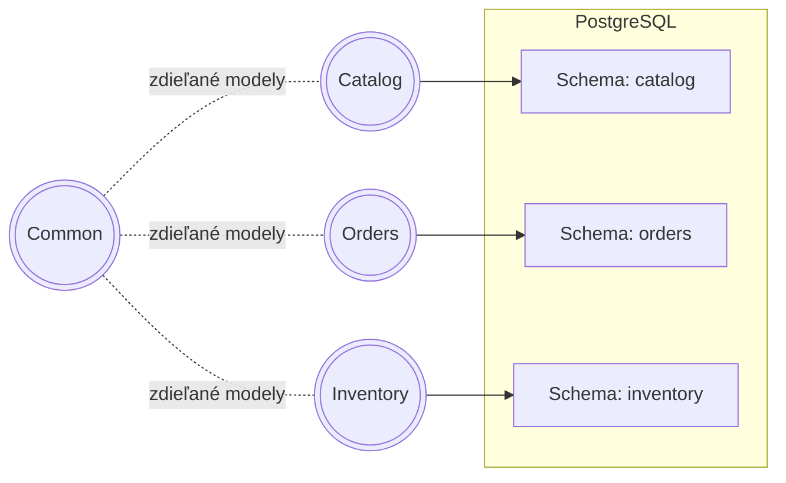
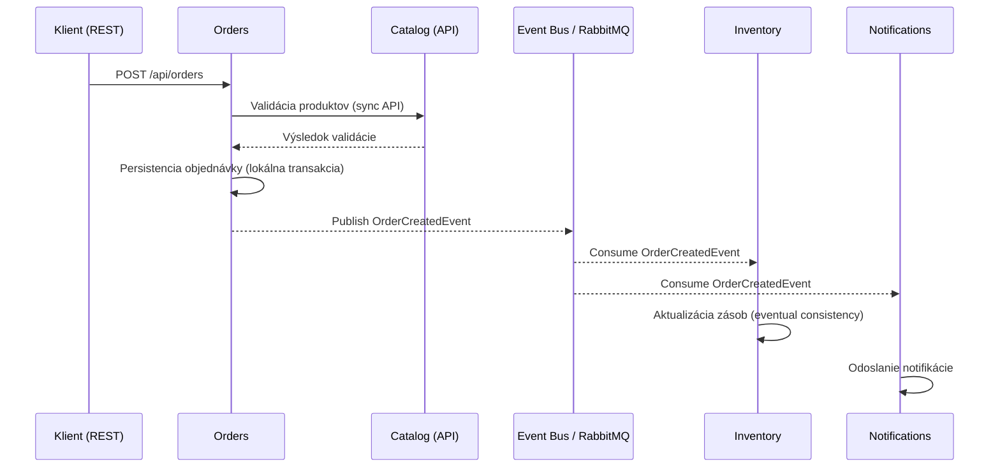
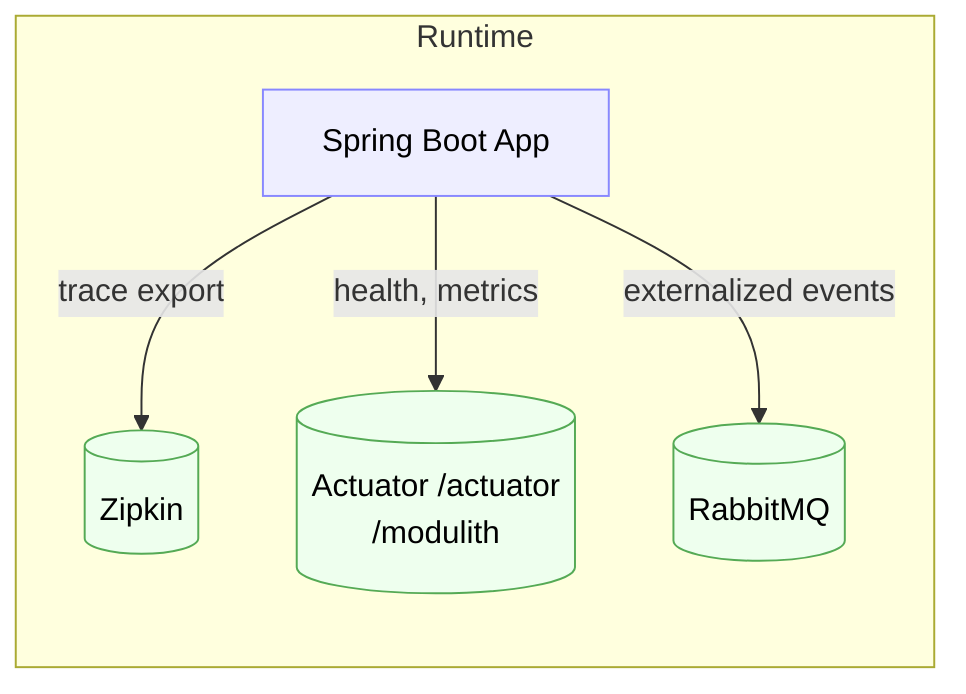
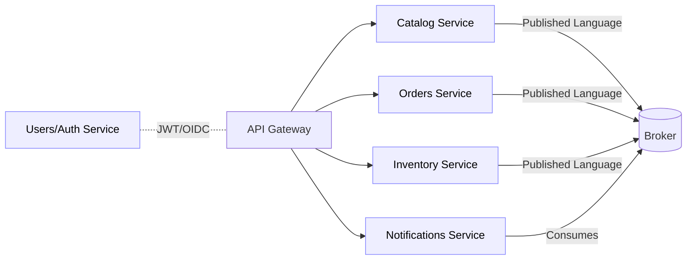
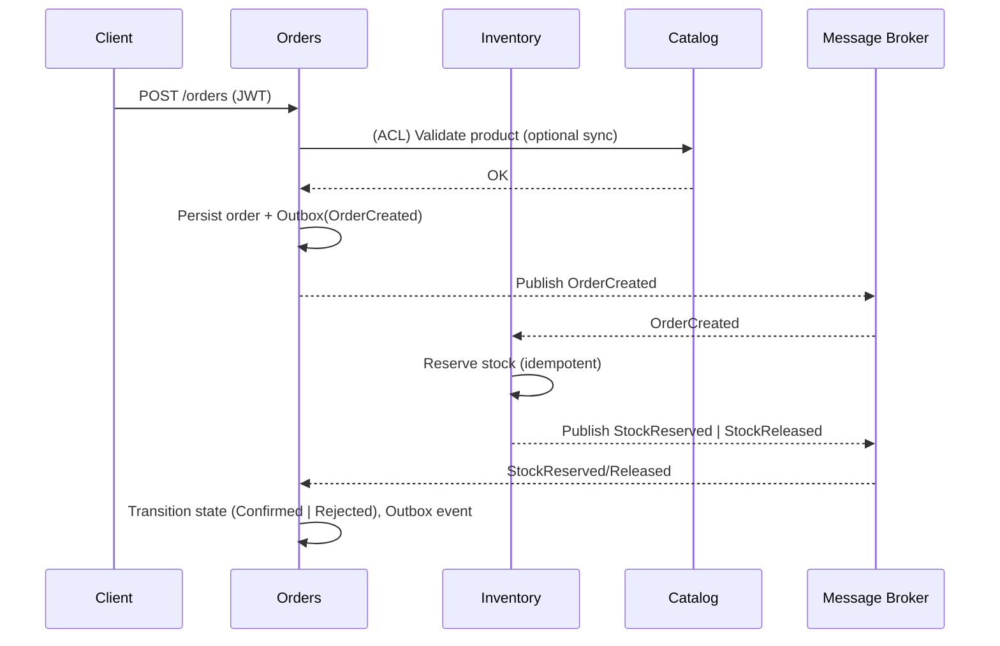

# Domain-Driven Decomposition for Microservices: Migration Study

**Doménovo orientovaná dekompozícia ako stratégia migrácie z monolitov na mikroslužby**

**Typ dokumentu:** Industry whitepaper (teoretická fáza, bez produkčnej telemetrie)

**Autori:** …

**Kľúčové pojmy:** DDD, bounded context, context map, Strangler Fig, Saga, outbox, idempotencia, 12‑Factor, observability

---

## Executive Summary

* Prečo DDD pre migrácie: presné hranice, menšia prepojenosť, lepšia zmenovosť.
* Čo dokument prináša: rámec, metriky, migračné vzory, hodnotiace kritériá.
* Čo dokument neobsahuje: implementáciu, produkčnú telemetriu, kompletnú refaktorizáciu.
* Pre koho: architekti, tech leadri, vlastníci domény.

---

## Abstrakt

Článok medzi monolitom a mikroslužbami skúma doménovo orientovanú dekompozíciu vedenú DDD a vzormi Strangler Fig, Saga a outbox. Ako prípadovú štúdiu používame verejný repozitár **andrejvysny/spring-modular-monolith**: e‑commerce **modulárny monolit** postavený na **Spring Modulith** s modulmi **Common, Catalog, Orders, Inventory, Notifications**; každý modul spravuje vlastné dáta (oddelené schémy `catalog`, `orders`, `inventory`) a preferuje **event‑driven** komunikáciu. Modul **Orders** pri úspešnom vytvorení objednávky publikuje **OrderCreatedEvent**, ktorý konzumujú **Inventory** a **Notifications**; udalosť sa zároveň propaguje do externého brokera (**RabbitMQ**). Repo poskytuje pripravené **observability** a **ops** podklady: **Zipkin**, **Spring Actuator** vrátane **/actuator/modulith**, **Docker Compose** a manifesty pre **Kubernetes/KinD**; build je **Maven/JDK 24**. Táto konfigurácia umožňuje navrhnúť realistický migračný plán bez produkčnej telemetrie a vytvoriť overiteľné rozhodovacie artefakty (mapy kontextov, kontrakty, návrhy Ság a ACL) pre neskoršiu empirickú fázu.

---

## 1. Úvod

Modernizačné projekty informačných systémov často narážajú na limity monolitickej architektúry: rastúcu komplexitu, expanzívnu „zmenovú plochu“ a skryté väzby medzi modulmi, ktoré sťažujú zmeny a zvyšujú riziko regresií. V prostredí s rýchlo sa meniacimi požiadavkami to vedie k spomaleniu dodávky a k nárastu operačného rizika. Strategické princípy doménovo orientovaného návrhu (DDD) ponúkajú spôsob, ako zosúladiť softvérový dizajn s mentálnym modelom domény a vytvoriť agendu pre udržateľnú dekompozíciu systému do jasne ohraničených častí.

Praktická skúsenosť ukazuje, že heuristické alebo technológiou vedené „rezy“ monolitu často zlyhávajú. Bez explicitnej doménovej perspektívy dochádza k chybnej granularite služieb: príliš jemné delenie zvyšuje prevádzkovú zložitosť, príliš hrubé zachováva pôvodnú prepojenosť. Následkom sú nekonzistentné invarianty, rozkmitané zodpovednosti za dáta a potreba ťažkopádnych distribuovaných transakcií. Vzniká architektúra, ktorá je formálne distribuovaná, ale doménovo stále monolitická.

Tento whitepaper preto stavia riešenie na DDD v strategickej rovine. Základom sú **ohraničené kontexty** s vlastným slovníkom, modelom a vlastníkmi dát a **mapa kontextov**, ktorá popíše medzi‑tímové väzby (customer/supplier, partnership, conformist, anti‑corruption layer). Migrácia prebieha inkrementálne podľa vzoru **Strangler Fig**, ktorý umožňuje bezpečne obopnúť a postupne nahrádzať časť funkcionality bez „big‑bang“ prepisu. Konzistenčné a transakčné toky riešime pomocou **Ság** (s kompenzačnými krokmi), **outbox** vzoru a systematickej **idempotencie**, aby sme zvládli nevyhnutnú asynchrónnosť a zlyhania v distribuovanom prostredí. Prevádzkové zásady sa opierajú o **12‑Factor** metodiku a požiadavky na pozorovateľnosť (logy, metriky, trasy), čo vytvára rámec pre neskoršie merateľné hodnotenie.

Príspevkom dokumentu je **procesný rámec** použiteľný už v teoretickej fáze – bez prístupu k produkčnej telemetrii. Prinášame rozhodovacie šablóny pre navrhovanie hraníc a vzťahov medzi kontextmi, odporúčania k migrácii v rezoch s nízkym rizikom a konceptuálny hodnotiaci model. Cieľom je, aby architekti a vlastníci domény vedeli urobiť obhájiteľné rozhodnutia skôr, než sa začne implementácia, a aby boli pripravení na neskoršie doplnenie empirických dát.

Zvyšok dokumentu postupuje od stručného **pozadia a pojmov** k **metodickému rámcu**, následne k **migračnému plánu** a **hodnotiacemu modelu**. Záverečná **diskusia** sumarizuje získané ponaučenia, explicitne pomenúva kompromisy a nastavuje ďalšiu roadmapu na empirické overenie v laboratórnych alebo produkcii‑blízkych podmienkach.

---

## 2. Pozadie, pojmy a súvisiaca práca

Doménovo orientovaný návrh vychádza z predpokladu, že softvérový model má kopírovať jazyk a pravidlá domény. **Ohraničený kontext (Bounded Context)** tvorí hranicu, v ktorej platí jednotná sémantika a konzistenčné pravidlá; mimo nej sa významy menia a preklady sú nevyhnutné [1]. **Ubiquitous Language** zjednocuje slovník medzi biznisom a vývojom a minimalizuje kognitívne preklady pri zmene [1]. Na taktickej úrovni **agregát** chráni invarianty a určuje transakčné hranice, ktoré sa neskôr premietajú do rozhraní služieb. Praktická implikácia pre migrácie znie: mikroslužby majú rešpektovať hranice kontextov; zhodnosť „jedna služba ≈ jeden kontext“ je pravidlom palca, nie rigidnou normou [1,7].

Vzťahy medzi kontextmi formalizuje **Context Map**, ktorá popisuje kontrakty a asymetrie medzi tímami a modelmi. Typické vzory zahŕňajú **Customer/Supplier** (downstream špecifikuje požiadavky, upstream plánuje dodávku), **Partnership** (koordinované plánovanie a zdieľaná zodpovednosť), **Conformist** (downstream preberá model upstreamu) a **Anti‑Corruption Layer (ACL)**, ktorý tlmí „únik“ cudzích modelov prekladom a izoláciou [1,7]. V kontexte migrácie tieto vzťahy slúžia ako skoré indikátory rizík prepojenia a miest, kde sa oplatí investovať do prekladu modelov a explicitných protokolov.

Inkrementálnu náhradu monolitu umožňuje vzor **Strangler Fig**: nová vrstva (façade/proxy) postupne preberá jednotlivé toky a funkcionalitu, až kým pôvodný systém neostane obalený a dekomisovaný [2]. Tento postup znižuje riziko „big‑bang“ prepisu a dá sa modulovať podľa doménových priorít. Pri prechode na distribuované aktualizácie sa konzistencia riadi pomocou **Ság** – dlhších pracovných tokov zložených z lokálnych transakcií s definovanými kompenzáciami [3]. Proti problému duálneho zápisu používame **Transactional Outbox**, ktorý atómovo spája zmenu stavu a publikovanie udalosti v rámci jednej lokálnej transakcie, pričom odoslanie udalostí zabezpečí následný relé proces alebo tailovanie transakčného logu [4]. Namiesto sľubu „exactly‑once“ doručenia navrhujeme **idempotentné operácie** a tolerujeme **at‑least‑once** doručenie, čím sa znižuje krehkosť systému [4].

Prevádzkové zásady vychádzajú z metodiky **The Twelve‑Factor App**: deklaratívna konfigurácia, čistý kontrakt s prostredím, parita medzi vývojom a produkciou a dôraz na procesy bez stavov, čo uľahčuje škálovanie a nasadzovanie počas migrácie [5]. **Pozorovateľnosť** (logy ako event streamy, metriky, trasovanie požiadaviek) nie je doplnok, ale podmienka riadenia rizika pri cutoveroch a kompenzáciách [5]. Odolnosť podporujú spätný tlak, exponenciálne retry s jitterom, circuit breakers a izolácia „bulkheads“, aby lokálne poruchy neeskalovali na systémové incidenty.

Súčasné systematické prehľady dokumentujú, že identifikácia služieb kombinuje **DDD‑guidované hranice** s **analytickými technikami** (statická analýza závislostí, sledovanie volaní, topic‑modeling), pričom dôkazová báza o priamom vplyve na runtime metriky je zatiaľ čiastková a závislá od domény [6]. Priemyselné a akademické nástroje (napr. Context Mapper) ukazujú, ako strategické vzory DDD pretaviť do návrhových artefaktov a zmlúv služieb, čím znižujú riziko chybných hraníc a uľahčujú prechod k mikroslužbám [7]. Tieto poznatky rámcujú metodiku tohto whitepaperu: najprv vyjasniť doménu a kontexty, potom navrhovať rezy migrácie a transakčné toky so zabudovanou idempotenciou a pozorovateľnosťou.

---

## 3. Metodika a výskumné otázky (teoretická fáza)

Táto kapitola integruje výskumné otázky s metodikou postupu tak, aby bol rámec použiteľný bez produkčnej telemetrie a zároveň replikovateľný v ďalšej empirickej fáze. Metodika predpokladá, že východzí stav je monolit s identifikovateľnými doménovými pojmami a dostupnou dokumentáciou alebo zdrojovým kódom.

### 3.1 Výskumné otázky

* **RQ1:** Ako DDD‑guidované hranice znižujú zmenovú plochu a prepojenosť oproti intuitívnym technickým rezom?
* **RQ2:** Aké dopady majú Sagy, transactional outbox a idempotencia na riziká transakcií a na zotavenie z čiastkových zlyhaní?
* **RQ3:** Aké kritériá použiť na určenie vhodnej granularity ohraničených kontextov v úvodnej fáze migrácie?
* **RQ4:** Ktoré hrozby validity dominujú pri teoretickej príprave migrácie a ako ich minimalizovať v následnej empirickej fáze?

**Rozsah a predpoklady:** cieľové domény e‑commerce/rezervácie/billing; technologické rodiny Java/Spring, .NET, PHP (Laravel), Node (Express/Nest); bez produkčnej telemetrie; dôraz na rozhodovacie artefakty a overiteľné kritériá.

### 3.2 Postup a artefakty

**Fáza A – Doménové objavenie.** Vykonať kompaktný event storming zameraný na hlavné toky hodnoty a spúšťacie udalosti. Výstupom je doménový slovník, zoznam kľúčových invariantov a kandidáti na agregáty. Kritérium kvality: jednoznačné definície pojmov a ich vzťah k biznisovým cieľom.

**Fáza B – Návrh ohraničených kontextov.** Stanoviť hranice podľa zdieľaných invariantov, transakčných hraníc a tímovej zodpovednosti. Každý kontext má prideleného vlastníka dát a jasné API zodpovedajúce jeho modelu. Anti‑vzory: delenie podľa technických vrstiev, zdieľaná schéma medzi kontextmi.

**Fáza C – Context Map a kontrakty.** Určiť typy vzťahov (customer/supplier, partnership, conformist, ACL) a pre každý z nich definovať očakávania na zmenu a stabilitu kontraktov. Pri riziku modelového „úniku“ zaviesť ACL s publikovaným jazykom. Plánovať zmluvné testy rozhraní (konceptuálne, bez implementácie).

**Fáza D – Migračné rezy (Strangler).** Vybrať prvé rezy s vysokou hodnotou a nízkym rizikom. Odporúča sa začať čítacími tokmi alebo izolovanými funkčnými modulmi. Definovať „Definition of Done“: funkčná rovnocennosť, nezávislé nasadenie, žiadne nové zdieľané databázy, pripravené kompenzačné scenáre.

**Fáza E – Transakčné toky a konzistencia.** Zvoliť orchestráciu/choreografiu Ság podľa potreby koordinácie. Navrhnúť kompenzácie, použiť transactional outbox pre atómové publikovanie udalostí a navrhnúť idempotentné operácie na príjme. Uviesť, ktoré operácie vyžadujú „once‑only“ efekt a ako sa k nemu priblížiť pomocou de‑duplication a idempotentných kľúčov.

**Fáza F – Prevádzkové zásady a pozorovateľnosť.** Aplikovať 12‑Factor princípy (konfigurácia, build‑release‑run, logy ako event streamy) a navrhnúť minimálny balík observability: kľúčové logy, metriky a trasovanie potrebné pre cutovery a kompenzácie. Pripraviť „failure storyboards“ (očakávané poruchové scenáre a reakcie Ság).

**Fáza G – Riziká a rozhodovacie body.** Dokumentovať kľúčové rozhodnutia (ADR) s alternatívami a dôvodmi. Vyznačiť body, kde je možné re‑scopovať BC (ak sa objavia cez‑kontextové invarianty) a kde je potrebné pridať ACL.

### 3.3 Kritériá hodnotenia v teoretickej fáze

Bez produkčnej telemetrie sa používajú **proxy metriky** a kvalitatívne hodnotenie pripravenosti. Architektonické proxy: počet krížových závislostí medzi modulmi, prítomnosť závislostných cyklov a odhad „change‑surface“ ako počet miest dotknutých zmenou. Prevádzkovo‑dodávateľské proxy: očakávané SLO (cieľová p95 latencia, priepustnosť), nezávislosť releasov, čas nasadenia a štartu. Evidencia sa opiera o scenáre zlyhaní a analýzu kompenzačných tokov, nie o runtime merania.

### 3.4 Replikovateľnosť a príprava empirickej fázy

Metodika vyžaduje tieto artefakty: mapy kontextov, katalóg agregátov s invariantmi, návrh Ság (kroky a kompenzácie), plán ACL, ADR so záznamom rozhodnutí a plán observability. Tieto artefakty sú vstupom pre neskoršie experimenty a merania v laboratórnych podmienkach alebo v pilotnej prevádzke.

---

## 4. Cieľový repozitár a technológie

**Repozitár:** [andrejvysny/spring-modular-monolith](https://github.com/andrejvysny/spring-modular-monolith) – verejná fork varianta ukážkovej e‑commerce aplikácie na **Spring Modulith**. Projekt je licencovaný pod **Apache‑2.0** a obsahuje moduly **Common, Catalog, Orders, Inventory, Notifications**, s dôrazom na **nezávislosť modulov**, **udalostnú komunikáciu** a **izolované dátové schémy** (`catalog`, `orders`, `inventory`)  citeturn2view0.

**Komunikačné toky:** **Orders → Catalog** (validačné volanie cez public API), **Orders → (Inventory, Notifications)** cez **OrderCreatedEvent**; udalosť sa publikuje aj do **RabbitMQ** pre externých odberateľov  citeturn2view0.

**Prevádzka a nástroje:** **Docker Compose** (aplikačný kontajner + RabbitMQ + Zipkin), **Actuator** vrátane **/actuator/modulith**, **observability** cez **Zipkin**, **Kubernetes** manifesty pre **KinD**; požiadavky **JDK 24**, doplnkovo **go‑task** pre skriptované príkazy  citeturn2view0.

**Dôsledky pre metodiku:** modulárne hranice a udalostné väzby sú už explicitné, čo znižuje riziko chybnej granularizácie počas migrácie; oddelené schémy uľahčujú mapovanie vlastníctva dát na budúce mikroslužby.

---

## 4.1 Pôvodná architektúra (východzí stav)

Táto sekcia sumarizuje východzí stav repozitára ako **modulárneho monolitu** postaveného na Spring Modulith. Slúži ako **„starting point“** pre ďalšie kroky tejto štúdie. Popisuje architektonický štýl, hranice modulov, dátovú izoláciu, komunikačné vzory a operačné prvky bez uvádzania implementačných detailov.

### Architektonický štýl a runtime

Aplikácia je jeden spustiteľný artefakt (Spring Boot) so **silne ohraničenými modulmi**. Modulové hranice sú vedené balíčkovou štruktúrou a verifikované nástrojmi Spring Modulith. Cieľom je minimalizovať priame interné závislosti medzi modulmi a uprednostniť **udalostnú komunikáciu** tam, kde je to vhodné.

### Moduly a zodpovednosti

* **Common** – otvorený modul so spoločnými modelmi a utilitami.
* **Catalog** – správa produktového katalógu a poskytovanie interného API na validáciu produktov.
* **Orders** – prijatie a spracovanie objednávok; publikovanie doménovej udalosti po úspešnom vytvorení objednávky.
* **Inventory** – reakcia na udalosti súvisiace s objednávkou, úprava stavov zásob.
* **Notifications** – reakcia na udalosti a doručenie notifikácií (aktuálne reprezentované obsluhou udalostí).

### Dátová izolácia a perzistencia

Každý modul vlastní a spravuje **vlastnú schému** v databáze (napr. `catalog`, `orders`, `inventory`). Migrácie sú centralizované a spúšťané pri štarte aplikácie. Tento prístup zodpovedá princípu „**kto mení invarianty, vlastní dáta**“ a pripravuje pôdu na projekciu modulov do samostatných služieb bez zdieľaných tabuliek.



### Komunikačné štýly a protokoly

* **SYNCHRÓNNE (v procese):** modul **Orders** volá zverejnené **public API** modulu **Catalog** pri validácii položiek objednávky. Tým sa zachováva enkapsulácia a neobchádzajú sa repozitáre iných modulov.
* **ASYNCHRÓNNE (udalosti):** po úspešnom vytvorení objednávky **Orders** publikuje doménovú udalosť **OrderCreatedEvent**. **Inventory** a **Notifications** na ňu reagujú ako **downstream** konzumenti. Udalosti sú **externalizované** aj do brokera (RabbitMQ) pre odber mimo procesu.



### Bezpečnosť a rozhrania

Externé rozhranie tvoria REST endpointy pod `/api/**`. Prístup je oddelený od webovej vrstvy; nepredpokladá sa zdieľanie interných perzistentných modelov smerom navonok. V tejto teoretickej fáze nehodnotíme konkrétny IAM/SSO stack; bezpečnostná konfigurácia je riešená v samostatných konfiguračných triedach.

### Observability a operatíva

Projekt obsahuje pripravené **operatívne nástroje**: koncové body **Spring Actuator** (vrátane prehľadu modulov), integráciu **distributed tracing** cez **Zipkin** a zapojenie **RabbitMQ** ako správy udalostí. Súčasťou repozitára sú aj manifesty pre lokálne nasadenie do **KinD** a **Docker Compose** pre spustenie závislostí.



### Testovanie a verifikácia modularity

Modulárna štruktúra je verifikovateľná testami na úrovni modulov (bez nutnosti bootstrapu celej aplikácie) a podporuje integračné testovanie udalostí. Táto vlastnosť je kľúčová pre bezpečné rezy v migračnom scenári.

---

## 5. DDD analýza a cieľová architektúra (aplikácia na vybraný repozitár)

**5.1 Context Map (aktuálny stav – modulárny monolit):**


**Vysvetlenie:** Vzťah **Orders → Catalog** zodpovedá vzoru **Customer/Supplier**; **Inventory**/**Notifications** sú **downstream** konzumenti doménovej udalosti **OrderCreatedEvent**; Common je otvorený modul zdieľaný naprieč aplikáciou  citeturn2view0.

**5.2 Doménové invarianty a vlastníctvo dát:** Každý modul spravuje svoje dáta v oddelenej schéme (`catalog`, `orders`, `inventory`), čo je v súlade s princípom „kto mení invarianty, vlastní dáta“. To umožňuje priamu projekciu BC→mikroslužba bez zdieľaných databáz  citeturn2view0.

**5.3 Integrácia a pozorovateľnosť:** Preferovaný štýl je **event‑driven**; udalosti sú dostupné aj mimo procesu cez **RabbitMQ**. Aplikačná observability je pripravená cez **Spring Actuator** (vrátane **/actuator/modulith** pre pohľad na moduly) a **Zipkin** pre trasovanie  citeturn2view0.

---

## 6. Migračný plán (Strangler Fig – aplikácia na repozitár)

Táto kapitola definuje cieľovú architektúru mikroslužieb s dôrazom na DDD a načrtáva vysokoúrovňový refaktoračný rámec (nie implementačný návod). Uvádzame publikačne vhodný, akademicky orientovaný návrh s dôrazom na správne hranice, published language, idempotenciu a riadenie rizík.

### 6.1 Cieľová architektúra mikroslužieb (DDD‑konzistentná)

Mapovanie ohraničených kontextov (BC) → samostatné služby s vlastným dátovým úložiskom a kontraktmi:

- Catalog Service (BC: Catalog) – kurátor produktov, zdroj pravdy o produktoch, publikuje ProductChanged.
- Orders Service (BC: Orders) – riadi životný cyklus objednávok, publikuje OrderCreated/OrderCancelled/OrderConfirmed.
- Inventory Service (BC: Inventory) – zodpovedá za stav zásob, reaguje na objednávky, publikuje StockReserved/StockReleased.
- Notifications Service (BC: Notifications) – doručovanie notifikácií; konzument udalostí, bez vlastných invariantov iných BC.
- Users/Auth Service (BC: Identity & Access) – identita, JWT/OIDC; žiadne priame zdieľanie dát s inými BC.

Podporné prvky: API Gateway (vyjednávanie verzií, rate‑limiting), Message Broker (RabbitMQ/Kafka), Observability (tracing, metriky), Outbox relay v každej službe.

```mermaid
flowchart LR
  subgraph Edge[Edge / API layer]
    Client[Clients (Web, Mobile, 3rd‑party)]
    APIGW[API Gateway]
  end

  subgraph S1[Catalog Service]
    CDB[(catalog DB)]
  end
  subgraph S2[Orders Service]
    ODB[(orders DB)]
  end
  subgraph S3[Inventory Service]
    IDB[(inventory DB)]
  end
  subgraph S4[Notifications Service]
    NDB[(notifications DB)]
  end
  subgraph S5[Users/Auth Service]
    UDB[(users DB)]
  end

  MB[(Message Broker)]
  Obs[(Observability: Traces/Metrics/Logs)]

  Client --> APIGW
  APIGW --> S1
  APIGW --> S2
  APIGW --> S3
  APIGW --> S4
  APIGW --> S5

  S2 -- OrderCreated/Cancelled/Confirmed --> MB
  S1 -- ProductChanged --> MB
  S3 -- StockReserved/Released --> MB
  MB -- subscribe --> S3
  MB -- subscribe --> S4
  MB -- subscribe --> S2

  S1 --> CDB
  S2 --> ODB
  S3 --> IDB
  S4 --> NDB
  S5 --> UDB

  S1 --- Obs
  S2 --- Obs
  S3 --- Obs
  S4 --- Obs
  S5 --- Obs
```

Architektonické zásady:

- Jeden BC = jedna služba s vlastným úložiskom a published language (udalosti + API). Žiadne zdieľané tabuľky.
- Komunikácia medzi BC preferenčne asynchrónna (udalosti), synchronná iba pre ne‑kritické dopyty s ACL.
- Outbox vzor v každej službe (atomizácia zmeny a publikovania). Idempotentní konzumenti, at‑least‑once doručenie.
- Kontraktové a verziovacie pravidlá: semver pre API, verzie schém udalostí, backward/forward kompatibilita.
- Pozorovateľnosť a bezpečnosť ako „first‑class“: trasovanie cez hranice BC, jednotný IAM (JWT/OIDC), politiky na API Gateway.

#### 6.1.1 Vlastníctvo dát a perzistencia

- Každá služba vlastní svoj model a schému; nepovoľuje sa priame čítanie cudzej DB. Integrácia prebieha výlučne cez kontrakty (API/udalosti).
- Odporúčaný štýl perzistencie: relačná DB pre Orders/Inventory (ACID transakcie), relačná alebo dokumentová DB pre Catalog podľa potreby vyhľadávania.
- História udalostí a outbox tabuľky sú súčasťou domény každej služby (nie centrálne úložisko). Retencia a GDPR‑politiky sú definované per BC.

#### 6.1.2 Kontrakty, published language a verzovanie

- Synchronné kontrakty: REST (alebo GraphQL pre čítania) s prísnym verzovaním (semver), deprecations s časovým oknom a zmluvnými testami.
- Asynchrónne kontrakty: doménové udalosti s explicitnou schémou (JSON/Avro). Povinné polia „eventId“, „version“, „occurredAt“, „producer“, „correlationId“ (napr. orderNumber).
- Registry kontraktov: odporúčaná git‑centrická správa schém + validácia v CI (Pact/CDC, JSON‑Schema/Avro‑compatibility check).

Príklad obálky udalosti (event envelope):

```json
{
  "eventId": "e8a2d2b0-9f3c-4c19-9f3e-54b0f3c2fa10",
  "type": "OrderCreated",
  "version": 2,
  "occurredAt": "2025-10-20T12:34:56.789Z",
  "producer": "orders-service",
  "correlationId": "ORD-2025-001234",
  "payload": {
    "orderNumber": "ORD-2025-001234",
    "items": [{"code": "P100", "qty": 1, "price": 34.00}],
    "customer": {"name": "Siva", "email": "siva@example.com"}
  }
}
```

#### 6.1.3 Konzistencia, CQRS a cache stratégie

- Zápisy a zmeny stavu: cez udalosti a Sagy; Orders je zdroj pravdy pre životný cyklus objednávok, Inventory pre dostupnosť.
- CQRS: čítacie modely pre agregované pohľady (napr. Orders+Inventory pre „order status with stock“) sa budujú projekciami; cache s TTL a invalidáciou z udalostí.
- Outbox + idempotencia: at‑least‑once doručenie akceptované; konzumenti používajú eventId a business key (orderNumber) pre deduplikáciu.

#### 6.1.4 Bezpečnosť a IAM (zero‑trust)

- Autentifikácia: JWT/OIDC cez Users/Auth; služby validujú tokeny lokálne (resource server model) bez centrálnej session.
- Autorizácia: scope/role claims pre čítania/zápisy per BC; minimálne privilegované DB identity per služba.
- Ochrana dát: klasifikácia PII, šifrovanie „at rest“ a „in transit“, rotácia kľúčov, audit prístupov a udalostí.

#### 6.1.5 Observability a SLO

- Traces: automatická propagácia trace‑contextu aj v udalostiach (inject/extract do event headers) pre end‑to‑end koreláciu.
- Metriky: SLI pre p95/p99 latencie, chybovosť, doručené vs. kompenzované Sagy, pomer re‑delivery udalostí.
- Logy: štruktúrované, s correlationId; sampling pre vysokú priepustnosť.

#### 6.1.6 Škálovanie a odolnosť

- Horizontálne škálovanie: nezávislé na úrovni služby; pre udalosti použitie consumer groups (paralelizácia podľa partitioning key – napr. productCode alebo orderNumber).
- Odolnosť: timeouts, retries s exponenciálnym backoff + jitter, circuit breakers, bulkheads; dead‑letter queue pre neúspešné spracovania.

#### 6.1.7 Nasadenie a infraštruktúra

- Kontajnerizácia a Kubernetes (namespaces per BC), deklaratívna konfigurácia (ConfigMap/Secrets), IaC pre infra artefakty.
- API Gateway s canary/blue‑green routingom pre bezpečné cutovery; traffic shaping pri migráciách.
- Každá služba s vlastným CI/CD pipeline, kontraktové testy ako brána do produkcie.

#### 6.1.8 Riadenie zmien a governance

- Politika deprecations: oznámenie, dual‑publish udalostí (v1+v2) na prechodné obdobie, meranie adopcie spotrebiteľov.
- ADR a architektonická dokumentácia: pre BC rozhodnutia, zmeny invariantov a kontextové mapy.

##### Cieľová Context Map (po migrácii)



### 6.2 DDD mapovanie a princípy na úrovni služby

Nasledujúci diagram sumarizuje DDD prvky pre každú službu (agregáty, invariants, udalosti, ACL, typy integrácie):

```mermaid
classDiagram
  class CatalogService {
    +Aggregates: Product
    +Invariants: code unique, price numeric>=0
    +EventsOut: ProductChanged(v,occurredAt)
    +EventsIn: -
    +API: GET /products, GET /products/{code}
    +ACL: PublishedLanguage only
    +DB: schema catalog
  }
  class OrdersService {
    +Aggregates: Order
    +ValueObjects: OrderItem, Customer
    +Invariants: nonEmptyItems, validStatusFlow, priceIntegrity
    +EventsOut: OrderCreated, OrderCancelled, OrderConfirmed
    +EventsIn: StockReserved, StockReleased, PaymentCaptured
    +API: POST /orders, GET /orders{,/{id}}
    +ACL: CatalogACL (sync), optional ProductView
    +DB: schema orders
  }
  class InventoryService {
    +Aggregates: StockItem
    +Invariants: nonNegativeStock, idempotentReservation
    +EventsOut: StockReserved, StockReleased
    +EventsIn: OrderCreated, OrderCancelled
    +API: GET /inventory/{code}
    +ACL: PublishedLanguage only
    +DB: schema inventory
  }
  class NotificationsService {
    +Aggregates: -
    +Invariants: deliveryAtLeastOnce
    +EventsOut: NotificationSent(optional)
    +EventsIn: OrderCreated, OrderConfirmed
    +API: - (internal)
    +ACL: PublishedLanguage only
    +DB: outbox/log store
  }
  class UsersService {
    +Aggregates: User
    +Invariants: emailUnique, passwordPolicy
    +EventsOut: - (optional UserRegistered)
    +EventsIn: -
    +API: /login, /users
    +ACL: JWT/OIDC provider
    +DB: schema users
  }
```

Orientačná sekvencia Sagy „PlaceOrder“ (choreografia; orchestrátor môže byť súčasťou Orders):



### 6.3 Refaktoračný rámec (vysokoúrovňový, akademický)

Zásady (čo robiť):

- Rešpektovať BC a posilniť agregáty: presuňte pravidlá a invarianty do agregátov; služby nech orchestrujú, nie „vlastnia“ pravidlá.
- Preferovať published language: udalosti sú primárny kontrakt; synchronné volania cez ACL, nie priamy model inej služby.
- Zaviesť outbox + idempotenciu: každý producent používa transactional outbox; konzumenti de‑duplikujú podľa eventId a kľúčov idempotencie.
- Verzionovať kontrakty: schémy udalostí a API s dôrazom na backward kompatibilitu; explicitné release poznámky k zmenám doménového jazyka.
- Automatizovať verifikáciu: zmluvné testy (CDC), modulárne verifikátory hraníc, simulácie chýb (chaos/latency injection) pre Sagy.
- Pozorovateľnosť: korelačné ID (orderNumber), trace‑context v udalostiach, metriky úspešnosti kompenzácií a latencie Ság.
- Bezpečnosť: jednotné identity (JWT/OIDC), politiky na API Gateway, minimálne privilegované DB identity na službu.

Antivzory (čomu sa vyhnúť):

- Zdieľané databázy medzi službami alebo cross‑service JOINy.
- „Big‑bang“ refaktoring bez cutover stratégie a bez merateľných DoD.
- Nekontrolované synchronné reťazenie volaní (cascading failures) bez timeoutov a circuit breakers.
- Udalosti bez verzie a bez identít (nemožné vyhodnocovať idempotenciu a evolúciu).

Odporúčané rozhodovacie kritériá:

- Granularita služby = hranice zdieľaných invariantov; ak invarianty presakujú medzi BC, re‑scopovať hranice.
- Orchestrácia vs choreografia: ak tok vyžaduje centrálne podmienky (napr. platba), zvážte orchestrátor v Orders; inak uprednostnite jednoduchú choreografiu.
- Sync vs async: zápisy a zmeny stavu cez udalosti; synchronné volania len pre čítania alebo pred‑overenia s degradovateľným správaním.

### 6.4 Migračná stratégia (Strangler Fig – rezy a cutovery)

Navrhované rezy (bez implementačných detailov):

1) Catalog‑Read slice: vyčleniť čítacie API katalógu za API Gateway; pripraviť ProductChanged a voliteľnú projekciu v Orders.
2) Orders outbox & events: formalizovať OrderCreated (envelope: eventId, version, occurredAt, correlationId), zaviesť outbox a CDC/relay.
3) Inventory service: extrahovať ako nezávislého konzumenta; zaviesť idempotenciu a minimálne kontrolné metriky (reserve success rate, negative stock guard).
4) Notifications: extrahovať ako „easy win“; doručovanie aspoň raz, retry/backoff.
5) Users/Auth: stabilizovať ako IdP s JWT/OIDC; odpojiť peer‑to‑peer väzby.
6) Orchestration maturity: doplniť StockReserved/Released a OrderConfirmed/Cancelled; ak sa pridá Payments/Shipping, definovať Sagy a kompenzácie.

Cutover a validácia:

- DoD: funkčná rovnocennosť pre rezy, nezávislé nasadenie, žiadne nové zdieľané tabuľky, SLO pre latencie čítaní a percento úspechu Ság.
- Rollback: traffic switches na API Gateway (feature flags), idempotentné kompenzácie.
- Evidencia: zmluvné testy, „failure storyboards“, trace‑based analýza latencií.

---

## 7. Hodnotiaci rámec (bez produkčných meraní)

**7.1 Architektonické metriky (proxy):** súdržnosť modulov (tematická/pomenovaná), počet krížových závislostí; závislostné cykly; „change‑surface“ (počet miest dotknutých zmenou).

**7.2 Prevádzkovo‑dodávateľské metriky (konceptuálne):** cieľová p95 latencia, priepustnosť, chybovosť; časy nasadenia a spustenia; nezávislosť releasov; MTTR.

**7.3 Evidencia bez telemetrie:** analytické odôvodnenie, rizikové scenáre, „failure storyboards“, porovnanie variantov (tabuľka trade‑offov).

**Šablóna porovnania:**

| Aspekt              | Monolit (východzí stav) | Cieľ – mikroslužby | Trade‑off |
| ------------------- | ----------------------- | ------------------ | --------- |
| Súdržnosť           |                         |                    |           |
| Prepojenosť         |                         |                    |           |
| p95 latencia (cieľ) |                         |                    |           |
| Priepustnosť (cieľ) |                         |                    |           |
| Chybovosť (cieľ)    |                         |                    |           |
| Nasadenie/štart     |                         |                    |           |

---

## 8. Diskusia

* Kedy DDD najviac pomáha: nejednoznačné modely, časté zmeny, viac tímov.
* Riziká: pre‑granularita, prehnané ACL, koordinácia Ság.
* Praktické tipy: začať čítaním, znižovať coupling, chrániť invarianty, zaviesť idempotenciu.

---

## 9. Záver a roadmapa

Vybraný repozitár už poskytuje jasné modulové hranice, udalosť **OrderCreatedEvent**, izolované schémy a pripravené operačné prostredie (Docker Compose, Actuator, Zipkin, Kubernetes/KinD), čo adekvátne podporuje teoretickú fázu migrácie. Roadmapa sa preto zameriava na adaptáciu existujúcej modularity na distribučné hranice.

**Roadmapa:** (1) Formalizovať **Context Map** s kontraktmi a pravidlami zmeny; (2) Zaviesť **outbox** a idempotentné odbery pre udalosti objednávok; (3) Overiť čítací **Catalog‑Read** slice proti SLO; (4) Navrhnúť **Sagu PlaceOrder** s kompenzáciami; (5) Pripraviť experimenty pre pilotnú prevádzku (syntetické dáta) s observability.

---

## Referencie

[1] Evans, E. *Domain‑Driven Design: Tackling Complexity in the Heart of Software.* Addison‑Wesley, 2003. URL: [https://ptgmedia.pearsoncmg.com/images/9780321125217/samplepages/0321125215.pdf](https://ptgmedia.pearsoncmg.com/images/9780321125217/samplepages/0321125215.pdf)

[2] Fowler, M. “Strangler Fig Application.” 2004–2024, martinfowler.com. URL: [https://martinfowler.com/bliki/StranglerFigApplication.html](https://martinfowler.com/bliki/StranglerFigApplication.html)

[3] Garcia‑Molina, H.; Salem, K. “Sagas.” *Proceedings of ACM SIGMOD*, 1987, pp. 249–259. DOI: 10.1145/38713.38742. URL: [https://dl.acm.org/doi/10.1145/38713.38742](https://dl.acm.org/doi/10.1145/38713.38742)

[4] Richardson, C. “Pattern: Transactional Outbox.” microservices.io, 2023–2025. URL: [https://microservices.io/patterns/data/transactional-outbox.html](https://microservices.io/patterns/data/transactional-outbox.html)

[5] Wiggins, A. et al. “The Twelve‑Factor App.” 12factor.net, 2011–2025. URL: [https://12factor.net/](https://12factor.net/)

[6] Abgaz, Y.; McCarren, A.; Elger, P.; et al. “Decomposition of Monolith Applications Into Microservices Architectures: A Systematic Review.” *IEEE Transactions on Software Engineering*, 2023. DOI: 10.1109/TSE.2023.3287297. URL: [https://doras.dcu.ie/28925/2/Decomposition_of_Monolith_Applications_Into_Microservices_Architectures_A_Systematic_Review.pdf](https://doras.dcu.ie/28925/2/Decomposition_of_Monolith_Applications_Into_Microservices_Architectures_A_Systematic_Review.pdf)

[7] Krebs, S.; Kapferer, S.; Zimmermann, O.; et al. “Domain‑Driven Service Design.” SoC 2020 (authors’ copy). URL: [https://contextmapper.org/media/SummerSoC-2020_Domain-driven-Service-Design_Authors-Copy.pdf](https://contextmapper.org/media/SummerSoC-2020_Domain-driven-Service-Design_Authors-Copy.pdf)

[8] **andrejvysny/spring-modular-monolith** – „A modular monolith application built with Spring Modulith“, README a projektové súbory. URL: [https://github.com/andrejvysny/spring-modular-monolith](https://github.com/andrejvysny/spring-modular-monolith)

---

## A. Replikačný balíček (šablóny)

* Šablóna pre Context Map (Mermaid).
* Šablóna katalógu agregátov a invariantov.
* Šablóna Sagy (kroky, kompenzácie, idempotencia).
* Šablóna ACL (mapovanie starého modelu → nový model).

---

## B. Hrozby validity (teoretická fáza)

* Konštruktová: zjednodušenie domény bez reálnych dát.
* Externá: prenositeľnosť medzi doménami.
* Záverová: bez telemetrie len kvalifikované odhady.
* Mitigácie: explicitné predpoklady, transparentné rozhodovacie kritériá, budúce merania.

---

## C. Praktické prílohy (pracovné listy)

* Check‑list „je BC na správnej granularite?“
* Check‑list „je endpoint idempotentný?“
* Check‑list „je Saga dostatočne kompenzovateľná?“

**Kontrolné otázky pre editora:**

* Je doménový slovník úplný?
* Sú hranice BC podporené invariantmi?
* Sú prvé migračné rezy nízkorizikové a merateľné?
